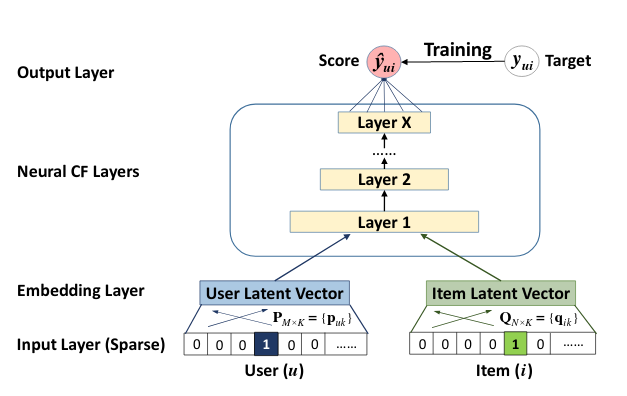

# Awesome-Papers

Awesome papers contrain list of papers that I go through over the time. Try to crate quick summary and key points from the papers for helping myself. If it helps others then it would be great. Papers are categorized based on domain of the papers

## NLP

### 26 Aug 2017
 - **Paper:** [Neural Collaborative Filtering](https://arxiv.org/pdf/1708.05031.pdf)
 - **Domain:** `Recommender systems`, `Collaborative  Filtering`,  `Matrix Factorization`, `Implicit Feedback`
 - **Dataset:** `Movie Lens`
 - **Discussion:** [Introducing TensorFlow Recommenders ](https://blog.tensorflow.org/2020/09/introducing-tensorflow-recommenders.html)
 - **Key points:** Present a general framework named NCF, short for Neural network-based Collaborative Filtering. NCF is generic and can ex-press and generalize  matrix factorization under its frame-work. To supercharge NCF modelling with non-linearities,we propose to leverage a multi-layer perceptron to learn theuser–item  interaction  function. Extensive  experiments on two real-world datasets show significant improvements of ourproposed NCF framework over the state-of-the-art methods. Empirical evidence shows that using deeper layers of neuralnetworks offers better recommendation performance.

Neural collaborative filtering framework

### 16 May 2016
 - **Paper:** [Large Scale Distributed Semi-Supervised Learning Using Streaming Approximation](https://arxiv.org/pdf/1512.01752.pdf)
 - **Domain:** `Graph based semi-supervisedlearning (SSL)`, `Knowledge graph, Graph neural netwrok`, `Chatbot`, `Conversation AI`
 - **Dataset:** `Freebase-Entity`, `Freebase-Relation`
 - **Discussion:** [On device machine intelegence for chat applications](https://ai.googleblog.com/2017/02/on-device-machine-intelligence.html)
 - **Key points:** Graph  augmentation strategy using unsupervised deep learning architectures that yields further significantquality gains for SSL in natural  language applications.
 

In top messages along with projections and corresponding replies, if available, are used in a machine learning framework to jointly learn a “message projection model”. (Bottom) The message projection model learns to associate replies with the projections of the corresponding incoming messages. For example, the model projects two different messages “Howdy, everything going well?” and “How’s it going buddy?” (bottom center) to nearby bit vectors and learns to map these to relevant replies (bottom right).

### 22 July 2015
 - **Paper:** [A Neural Conversational Model](https://arxiv.org/pdf/1506.05869.pdf)
 - **Domain:** `Chatbot`, `Conversation AI`
 - **Dataset:** `IT helpdesk troubleshooting`, `Open domain movie transcript`
 - **Discussion:** [Towards a Conversational Agent that Can Chat About Anything ](https://ai.googleblog.com/2020/01/towards-conversational-agent-that-can.html)
 - **Key points:** Our approach makes use of the sequence-to-sequence(seq2seq) framework.The model is based on a recurrent neural network whichreads the input sequence one token at a time, and predictsthe output sequence, also one token at a time. During train-ing, the true output sequence is given to the model, so learn-ing can be done by backpropagatio
 

 
 The seq2seq framework for modeling conversations.

## Computer vision

### 22 Sep 2020
 - **Paper:** [PP-OCR: A Practical Ultra Lightweight OCR System](https://arxiv.org/pdf/2009.09941.pdf)
 - **Domain:** `Text detection`, `Direction classification`, `Text recognition`

## Speech

### 27 Aug 2019
- **Paper:** [Jasper: An End-to-End Convolutional Neural Acoustic Mode](https://arxiv.org/pdf/1904.03288.pdf)
- **Domain:** `speech  recognition, convolutional networks,time-delay neural networks`
- **Dataset:**
- **Kye points:** This paper makes the following contributions:
  1.  We present a computationally efficient end-to-end con-volutional neural network acoustic model.
  2.  We show ReLU and batch norm outperform other combi-nations for regularization and normalization, and resid-ual connections are necessary for training to   converge.
  3.  We introduceNovoGrad, a variant of the Adam opti-mizer with a smaller memory footprint.
  4.  We improve the SOTA WER on LibriSpeech test-clean.
